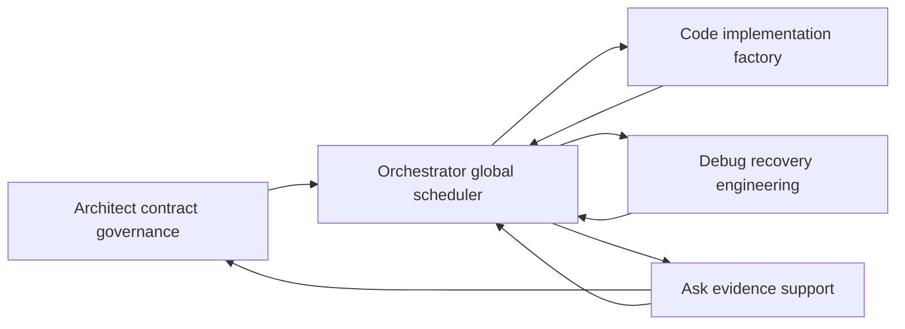
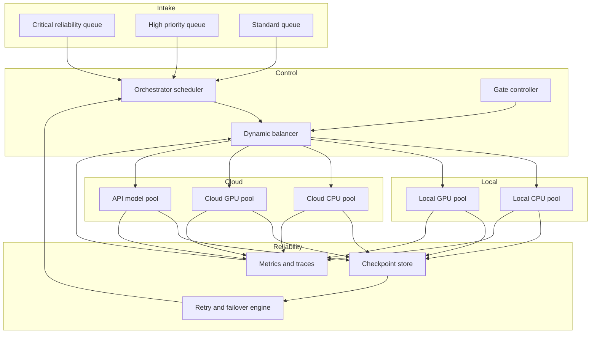

# Megazord Execution Topology Plan

## 0. Scope and directive lock

This document is the single implementation-ready planning artifact for resuming full-power Orchestrator execution with maximum reliable throughput.

Scope is planning and design only. No code changes are included in this artifact.

Primary optimization policy for all tradeoffs:

- **Max throughput with bounded reliability floors**
- Aggressive parallelism and cloud burst are required
- Reliability floors are non-negotiable: checkpointing, idempotency, failover, retry discipline, and recoverability

## 1. Baseline context and current constraints

Current substrate behavior and signals to design around:

- Community simulation supports wave execution with configurable concurrency via `--concurrency-limit` and parallel thread fan-out for codex provider workloads.
- Chain execution is currently sequential per run with staged pass semantics `research -> development -> testing`.
- Stage progression enforcement exists `local -> hosted_dev -> production`.
- Existing async execution pools are conservative in parts of the stack and do not yet represent a unified dynamic balancing controller.

Throughput and reliability signals from latest cycle artifacts:

- PR review latency is elevated with median and tail delay pressure.
- Flaky-test volume is the largest failure taxonomy category.
- Release readiness is below threshold with unresolved critical/high issues.

Design implication:

- We need **multi-queue scheduling + elastic resource control + reliability kernel** as first-class orchestration subsystems, not ad hoc per feature path.

---

## 2. Subsystem ownership model by specialist mode

## 2.1 Ownership map

| Subsystem | Primary owner mode | Responsibilities | Hard boundary | Required handoff outputs |
|---|---|---|---|---|
| S1 Control Plane and Global Scheduler | orchestrator | Queueing, routing, arbitration, scaling, stage-policy enforcement, global telemetry ingestion | Does not author subsystem architecture spec or implement code internals directly | `work_packet`, `dispatch_decision`, `recovery_order`, `run_status` |
| S2 Architecture and Contract Governance | architect | System decomposition, interfaces, reliability invariants, gate definitions, dependency DAG, conflict resolution policy | Does not execute code mutations or runtime incident remediation | `execution_blueprint`, `contract_schema`, `gate_spec`, `dependency_graph` |
| S3 Implementation Factory | code | Implement scheduler, workers, adapters, checkpoint store, retries, observability hooks, tests | Must not redefine architectural contracts unilaterally | `delivery_bundle`, `test_evidence`, `integration_notes` |
| S4 Incident Triage and Recovery Engineering | debug | Failure classification, reproduction, fault isolation, rollback and repair sequencing, flake quarantine policy | Must not expand scope beyond incident and validated remediation | `incident_bundle`, `root_cause_report`, `fix_plan`, `stability_evidence` |
| S5 Evidence and Knowledge Support | ask | Tooling and standards research, API boundary confirmation, command-level diagnostics guidance, risk evidence synthesis | No direct mutation, no scheduler authority | `evidence_digest`, `decision_brief`, `runbook_delta` |

## 2.2 Handoff contracts

Every handoff must be a typed payload with deterministic identifiers.

### Contract A: architect -> orchestrator

`execution_blueprint` minimum fields:

- `blueprint_id`
- `objective`
- `subsystems`
- `priority_policy`
- `reliability_floors`
- `gate_criteria`
- `resource_policy`
- `fallback_order`

### Contract B: orchestrator -> code or debug

`work_packet` minimum fields:

- `packet_id`
- `target_mode`
- `subsystem`
- `stage`
- `pass`
- `priority_class`
- `objective`
- `input_artifacts`
- `file_allowlist`
- `done_when`
- `checkpoint_policy`
- `retry_policy`
- `idempotency_key`
- `rollback_hook`

### Contract C: code -> orchestrator

`delivery_bundle` minimum fields:

- `packet_id`
- `changed_artifacts`
- `validation_results`
- `checkpoint_proof`
- `idempotency_proof`
- `known_risks`

### Contract D: debug -> orchestrator and code

`incident_bundle` minimum fields:

- `incident_id`
- `packet_id`
- `failure_class`
- `repro_steps`
- `failing_checkpoint`
- `repair_plan`
- `retest_scope`
- `reentry_gate`

### Contract E: ask -> architect or orchestrator

`evidence_digest` minimum fields:

- `question_id`
- `sources`
- `recommendations`
- `tradeoffs`
- `confidence`
- `adopt_or_reject`

## 2.3 Ownership flow diagram

---

## 3. Parallel execution topology and dynamic balancing

## 3.1 Workstream model

Define four concurrently active lanes:

- **L1 Reliability burn-down lane**
  - Handles critical and high-severity blockers first
  - Always reserved capacity
- **L2 Throughput implementation lane**
  - Feature and integration work packets with dependency-safe parallelism
- **L3 Validation and regression lane**
  - Deterministic retest, flaky isolation, cross-platform checks
- **L4 Observability and optimization lane**
  - Metrics tuning, bottleneck detection, scheduler calibration

All lanes run simultaneously with weighted arbitration.

## 3.2 Resource pools

Dispatch target pools:

- `local_cpu_pool`
- `local_gpu_pool`
- `cloud_cpu_pool`
- `cloud_gpu_pool`
- `api_model_pool`

Routing rules:

1. Attempt highest-throughput local execution first when queue pressure is moderate.
2. Burst to cloud pools when queue pressure or critical-lane backlog exceeds threshold.
3. Keep reliability reserve capacity isolated from best-effort throughput traffic.
4. Use API provider pool for planning, synthesis, and analysis tasks where local GPU/CPU is not superior.

## 3.3 Scheduling and balancing policy

Per scheduler heartbeat:

1. Compute lane pressure score:
   - `pressure = backlog_weight + age_weight + blocker_weight + retry_weight`
2. Rank ready packets by:
   - priority class
   - dependency unlock value
   - expected completion throughput per pool
3. Dispatch with reliability floors:
   - checkpoint coverage must remain at floor
   - idempotency key must be present
4. Rebalance active workers:
   - scale out pools when sustained pressure exceeds threshold for consecutive heartbeats
   - scale in only when critical queue is clear and stability remains above floor

Brute-force mode policy:

- Allowed only when reliability floors are green
- Enables max fan-out in L2 and L3 using cloud burst
- Automatically exits brute-force mode on floor violation or cascading retries

## 3.4 Elastic scaling requirements

- Horizontal scaling unit: worker group per pool
- Vertical scaling unit: per-worker concurrency cap
- Scale-out trigger inputs:
  - ready queue depth
  - blocked critical items
  - p95 completion latency
  - retry storm detection
- Scale-in trigger inputs:
  - sustained low utilization
  - low queue depth
  - no critical backlog

## 3.5 Execution topology diagram

---

## 4. Reliability architecture requirements

## 4.1 Checkpointing model

Mandatory checkpoint levels:

- **Run checkpoint** at run create and run complete boundaries
- **Step checkpoint** after each chain or task step artifact write
- **Wave checkpoint** after each parallel wave completion
- **Gate checkpoint** before pass or stage transitions
- **Recovery checkpoint** before replay

Checkpoint record requirements:

- immutable `checkpoint_id`
- `run_id`
- `packet_id`
- `stage`
- `pass`
- `wave_id`
- `idempotency_key`
- `artifact_manifest`
- `state_hash`
- `resume_from`

## 4.2 Retry and backoff requirements

Failure classes and actions:

- **Transient infrastructure failure**
  - auto-retry enabled with exponential backoff and jitter
- **Provider throttle or quota failure**
  - retry with provider-aware delay, then failover provider or pool
- **Deterministic logic failure**
  - no blind retry, route directly to debug lane
- **Policy or safety violation**
  - hard stop and escalate with incident bundle

Retry safety constraints:

- retry attempts must reuse same `idempotency_key`
- retries must bind to last valid checkpoint
- retries must emit structured retry telemetry

## 4.3 Failover requirements

Required failover order by workload class:

1. local preferred pool
2. alternate local pool
3. cloud equivalent pool
4. alternate cloud pool
5. API model fallback where applicable

Failover is legal only if:

- checkpoint continuity is preserved
- idempotency key continuity is preserved
- gate invariants remain satisfied

## 4.4 Idempotency requirements

All mutating operations must be idempotent by construction:

- deterministic operation key generation
- duplicate packet suppression before execution
- upsert semantics for run metadata and event logs
- artifact naming strategy with immutable packet lineage

## 4.5 Recovery sequencing

Recovery order after interruption:

1. Rehydrate run registry and find in-flight packets
2. Validate checkpoint integrity and artifact manifest hashes
3. Mark non-recoverable packets and emit incident bundles
4. Requeue recoverable packets from last good checkpoint
5. Replay dependencies in DAG-safe order
6. Re-run gates before stage/promotion continuation

Recovery completion condition:

- No in-flight packet without checkpoint lineage
- Critical queue restored to deterministic state

---

## 5. Rapid implementation integration validation loop

## 5.1 Cadence model

Cadence is event-driven and wave-driven, not calendar-driven:

- **Micro cadence**: every scheduler heartbeat performs route, rebalance, and retry decisions
- **Wave cadence**: every completed wave publishes throughput and stability deltas
- **Pass cadence**: every pass boundary executes gate suite and checkpoint seal
- **Stage cadence**: every stage boundary enforces promotion policy and rollback readiness

## 5.2 Gate criteria

| Gate | Trigger | Must pass criteria | Failure action |
|---|---|---|---|
| G0 Packet contract gate | Before dispatch | Required handoff schema complete, dependencies resolved | Reject packet and request contract correction |
| G1 Reliability floor gate | Before execution | Checkpoint policy attached, idempotency key attached | Block execution and escalate |
| G2 Execution gate | After execution | Command or step success and artifact manifest complete | Retry or route to debug by failure class |
| G3 Validation gate | After implementation wave | Deterministic test replay policy satisfied, no unresolved critical blocker in wave | Hold promotion and open incident bundles |
| G4 Throughput gate | After wave metrics publish | Queue drain trend positive and retry storm absent | Trigger rebalancer and adjust pool weights |
| G5 Promotion gate | Before stage advance | Stage policy satisfied, rollback path valid, reliability floors green | Prevent stage advance and continue burn-down |

## 5.3 Continuous optimization loop

Optimization controller inputs:

- queue depth by lane
- success and failure rate by pool
- retry rate and retry amplification
- median and p95 completion latency
- review latency trend
- flaky failure trend

Optimization actions:

- adjust pool weights
- tune concurrency caps
- alter failover preference ordering
- tighten or relax brute-force mode activation

---

## 6. Implementation packages for downstream execution

These packages are sequenced for parallelizable delivery in code and debug modes.

1. **PKG-1 Contract foundation**
   - Implement handoff schema validation and packet envelope
   - Wire mandatory reliability fields
2. **PKG-2 Scheduler core**
   - Multi-lane queues, dependency-aware prioritizer, dispatch engine
3. **PKG-3 Resource adapter layer**
   - Local and cloud pool adapters with elastic scaler hooks
4. **PKG-4 Reliability kernel**
   - Checkpoint store, retry classifier, failover router, idempotency enforcement
5. **PKG-5 Observability and control**
   - Real-time metrics, queue dashboards, alert surfaces, optimization loop
6. **PKG-6 Validation and replay harness**
   - Deterministic replay, chaos interruption tests, recovery drill execution
7. **PKG-7 Integration into community cycle and chain paths**
   - Align wave orchestration, run lifecycle, and stage gating with new scheduler

Each package requires explicit handoff artifacts at completion for orchestrator acceptance.

---

## 7. Success conditions for this topology

The topology is considered ready for execution when all are true:

- Ownership boundaries are enforced by handoff schema and mode responsibilities
- Global scheduler can run parallel lanes with dynamic balancing across local and cloud pools
- Reliability floors are enforced continuously and automatically
- Failover and recovery can resume interrupted workloads from checkpoints deterministically
- Implementation and validation loops operate continuously with explicit gate outcomes

---

## 8. Source anchors used for this plan

- Chain and prompt pipeline definition
- Orchestrator run lifecycle and stage policy enforcement
- Community wave execution and concurrency controls
- Current DB run and event model
- Current web async execution model
- Current deployment composition
- Latest cycle telemetry for risk and throughput pressure

This design is intentionally aligned to those anchors and extends them into a unified high-throughput reliable execution topology.
