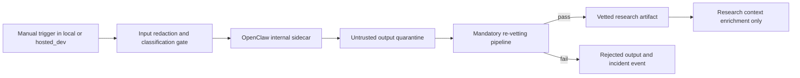
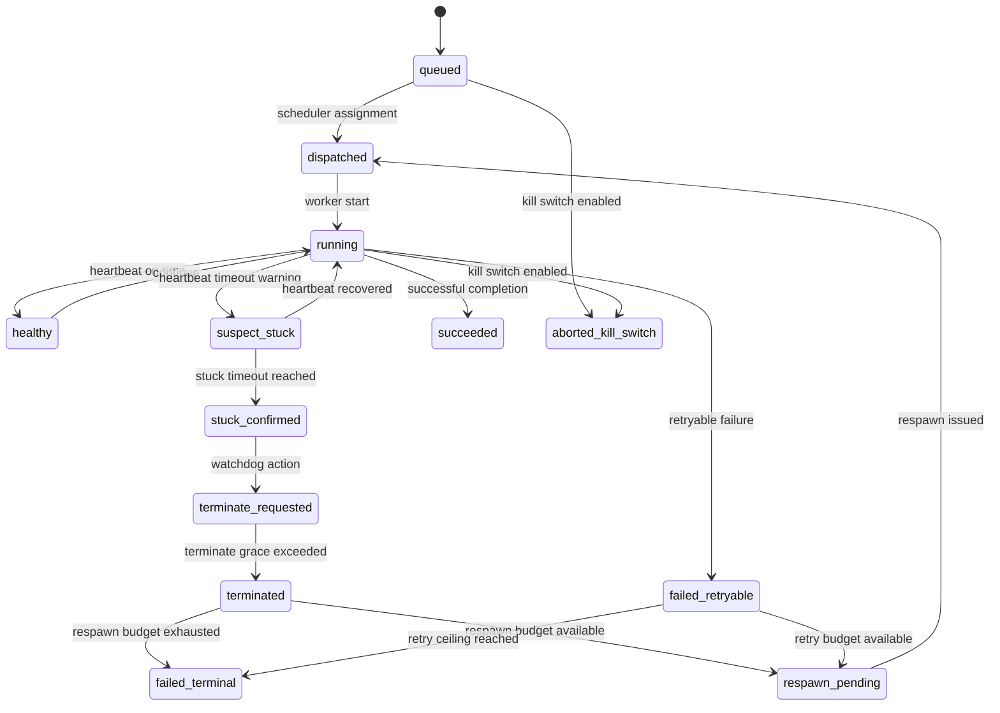

# RC1 Safe Execution Implementation Map

## 0. Scope lock and directive envelope

This artifact is planning-only and implementation-ready.

Parent objective: drive RC1-safe execution without reintroducing deadlocks.

Directive-locked OpenClaw operating envelope:

- Allowed stages: local and hosted_dev only
- Data class: synthetic or redacted inputs only
- Zero production data usage
- Manual trigger only
- Never on production runtime path

Primary source anchors:

- [work/megazord_execution_topology_plan.md](work/megazord_execution_topology_plan.md)
- [substrate/orchestrator.py](substrate/orchestrator.py)
- [substrate/reliability.py](substrate/reliability.py)
- [substrate/resource_orchestration.py](substrate/resource_orchestration.py)
- [README.md](README.md)
- [docs/orchestrator.md](docs/orchestrator.md)
- [docs/chains.md](docs/chains.md)
- [docs/deployment.md](docs/deployment.md)

---

## 1. Baseline risk framing for RC1-safe execution

Current runtime has strong retry and checkpoint primitives, but RC1-safe execution requires explicit bounding and deterministic progress guarantees in all long-running paths.

Key baseline characteristics to preserve:

- Stage progression policy local -> hosted_dev -> production
- Existing retry, failover, checkpoint, and idempotency foundations
- Resource scheduling with pressure-based routing and scaling hooks

RC1 deltas required by this plan:

1. Optional OpenClaw integration isolated to internal research-assist only
2. Hard trust boundary and mandatory re-vetting for all OpenClaw outputs
3. Bounded validation policy replacing unbounded stress patterns
4. Watchdog plus respawn plus retry-ceiling state model for deterministic forward progress
5. Phased rollout with minimal blast radius and reversible feature-flag rollback

---

## 2. Architecture decisions

### AD-1: OpenClaw is an internal side-lane, not a runtime provider lane

OpenClaw is modeled as a research-assist sidecar path only. It is never part of production chain execution and never part of production failover order.

### AD-2: OpenClaw output is always untrusted until re-vetted

All OpenClaw outputs land in quarantine and cannot flow directly into execution inputs, tasks, commands, or stage promotion decisions.

### AD-3: Every loop in validation and watchdog control must be bounded

No unbounded polling, no unbounded retries, and no indefinite blocking waits in critical execution paths.

### AD-4: Forward progress is state-machine-driven

Task lifecycle transitions are explicit, checkpointed, and bounded by retry and respawn ceilings.

### AD-5: RC1 changes are additive and feature-flagged

Default behavior remains current-safe baseline when flags are off. Rollback is achieved by disabling flags and draining affected queues.

---

## 3. Implementation map for optional OpenClaw internal research-assist

## 3.1 Control-plane boundaries

OpenClaw path is enabled only when all are true:

- feature flag enabled
- manual trigger flag present per run
- stage in local or hosted_dev
- pass in research only
- input classification passes synthetic_or_redacted requirement

Hard block conditions:

- stage is production
- production data classification detected
- auto-trigger attempt without explicit manual trigger

## 3.2 Integration surface map

| Surface | Planned RC1 responsibility | Blast-radius control |
|---|---|---|
| [substrate/orchestrator.py](substrate/orchestrator.py) | Add stage+pass+manual-trigger policy gate for internal research-assist dispatch and keep OpenClaw path outside production run path | Default-off flags, hard stage guard, no provider fallback linkage |
| [substrate/reliability.py](substrate/reliability.py) | Add bounded policy primitives and vetting status model that can be checkpointed | Additive types only, no baseline retry semantic break |
| [substrate/resource_orchestration.py](substrate/resource_orchestration.py) | Optional low-priority internal-assist queue pressure class to avoid starving reliability-critical work | Isolated queue weights, no change to critical-lane reservation |
| [chains/local-agent-chain.yaml](chains/local-agent-chain.yaml) | Add optional research-assist toggles and default-off envelope settings | Defaults keep behavior unchanged |
| [workspace.yaml](workspace.yaml) | Add policy-level allowlist for OpenClaw stage and data controls | Policy denies production by default |

## 3.3 OpenClaw isolation workflow

Non-negotiable invariant:

- Vetted OpenClaw artifacts can inform research context only. They cannot directly produce task commands, mutation directives, deployment actions, or production gate approvals.

---

## 4. Trust boundary and mandatory re-vetting pipeline

## 4.1 Trust contract

OpenClaw output trust level starts as untrusted.

Only artifacts that pass all vetting gates are reclassified as vetted_research_artifact.

## 4.2 Mandatory gate sequence

| Gate | Check class | Required pass condition | Failure action |
|---|---|---|---|
| V0 Intake policy | Stage and data policy | local or hosted_dev and synthetic_or_redacted only | Reject and log policy violation |
| V1 Schema and provenance | Structure and metadata integrity | Required fields present and provenance hash valid | Quarantine and reject |
| V2 Security screening | Unsafe directives and exfil patterns | No secrets leakage patterns or privileged command proposals | Reject and open security incident |
| V3 Correctness corroboration | Evidence and internal consistency | Claims tie to known source facts or local evidence set | Reject as unverified |
| V4 Policy compliance | Repo and stage policy constraints | No mutation or production-path policy breach | Reject and escalate |
| V5 Deterministic transform | Safe normalization to internal note format | Output transformed to non-executable typed artifact | Reject and retain quarantine |

## 4.3 Enforcement requirements

- No direct execution from raw OpenClaw output
- No direct insertion into task command strings
- No bypass path around vetting gates
- Every gate decision emits structured event and checkpoint lineage

## 4.4 Artifact classes

- openclaw_raw_quarantine
- openclaw_vetting_report
- vetted_research_artifact
- openclaw_rejected_artifact

---

## 5. Bounded validation policy replacing unbounded stress loops

## 5.1 Bounded policy contract

Define a bounded validation policy applied to every hardware or long-running validation action:

- max_wall_clock_seconds
- max_attempts
- max_respawns
- heartbeat_interval_seconds
- heartbeat_timeout_seconds
- stuck_confirmation_seconds
- terminate_grace_seconds
- kill_switch_poll_seconds
- queue_ttl_seconds

## 5.2 Execution rules

1. Every wait path uses monotonic deadline checks
2. Every retry path has explicit ceiling
3. Every subprocess or worker execution path is non-blocking from scheduler perspective
4. Every run has a kill-switch that can terminate in-flight work
5. Every timeout and forced termination is checkpointed with reason code

## 5.3 Replacement policy for unbounded stress loops

Replace open-ended stress patterns with bounded test matrix batches:

- fixed iteration cap per workload class
- fixed per-iteration timeout
- fixed per-batch attempt ceiling
- cool-down and requeue only within bounded budget

This preserves validation depth while preventing deadlock and infinite-loop risk.

---

## 6. Deterministic watchdog respawn retry-ceiling state model

## 6.1 State definitions

- queued
- dispatched
- running
- healthy
- suspect_stuck
- stuck_confirmed
- terminate_requested
- terminated
- respawn_pending
- succeeded
- failed_retryable
- failed_terminal
- aborted_kill_switch

## 6.2 Transition model

## 6.3 Deterministic forward-progress invariants

- attempt counter is monotonic and bounded
- respawn counter is monotonic and bounded
- each transition writes event plus checkpoint lineage
- no transition can re-enter running without explicit dispatch
- if retry and respawn budgets are exhausted, outcome is terminal and queue advances

## 6.4 Stuck-task detection algorithm

1. If heartbeat misses threshold, mark suspect_stuck
2. If suspect duration exceeds stuck_confirmation_seconds, mark stuck_confirmed
3. Issue terminate request, wait terminate_grace_seconds
4. If still alive, force terminate and mark terminated
5. Respawn only if retry and respawn budgets remain
6. Otherwise mark failed_terminal and emit incident record

---

## 7. Phased code and test execution plan with reversible rollback

## 7.1 Feature flags and rollback knobs

Default all flags to off for zero behavior drift.

- rc1_openclaw_internal_assist_enabled
- rc1_openclaw_manual_trigger_required
- rc1_openclaw_revetting_required
- rc1_bounded_validation_enabled
- rc1_non_blocking_validation_runner_enabled
- rc1_watchdog_enabled
- rc1_respawn_enabled

Rollback action is deterministic: disable the above flags and drain internal-assist queue while preserving baseline chain and task behavior.

## 7.2 Phase breakdown

### Phase P0: Guardrail scaffolding and policy defaults

- Add default-off config keys and stage/data allowlist envelope
- Add production hard-block assertions for OpenClaw path
- Tests: config parsing and production deny tests

Acceptance gate P0:

- With all flags off, existing orchestrator reliability tests continue passing unchanged

### Phase P1: OpenClaw internal side-lane wiring

- Add internal side-lane dispatch path in research pass only
- Add manual trigger requirement checks
- Keep outputs quarantined only in this phase

Acceptance gate P1:

- OpenClaw can run only in local and hosted_dev with manual trigger
- Production and non-research-pass attempts are denied

### Phase P2: Mandatory re-vetting pipeline enforcement

- Implement V0 to V5 gate chain
- Permit only vetted_research_artifact output class to exit quarantine

Acceptance gate P2:

- 100 percent of OpenClaw outputs have complete vetting lineage
- Zero raw-output direct-use paths remain

### Phase P3: Bounded validation execution controls

- Replace unbounded stress loops with bounded matrix policy
- Introduce non-blocking validation runner and kill-switch semantics

Acceptance gate P3:

- Synthetic stuck workload terminates within bounded timeout envelope
- No scheduler-thread blocking during long validations

### Phase P4: Watchdog and deterministic forward-progress model

- Implement state transitions and retry plus respawn ceilings
- Add stuck detection telemetry and incident classification

Acceptance gate P4:

- Stuck-task simulation resolves to succeeded or failed_terminal deterministically
- No infinite loop or deadlock in replay scenarios

### Phase P5: Staged rollout with minimal blast radius

- Enable flags in local first, then hosted_dev
- Keep production permanently blocked for OpenClaw path
- Run rollback drill by disabling flags and confirming baseline behavior

Acceptance gate P5:

- Rollback can be executed without schema break or run-history corruption
- Baseline non-OpenClaw execution remains stable post-rollback

## 7.3 Test map by file

- Extend [tests/test_orchestrator_reliability.py](tests/test_orchestrator_reliability.py) for stage+pass guards, manual trigger, and production deny paths
- Extend [tests/test_reliability.py](tests/test_reliability.py) for bounded policy ceilings, kill-switch semantics, and transition invariants
- Extend [tests/test_resource_orchestration.py](tests/test_resource_orchestration.py) for non-blocking scheduling under pressure and queue-forward-progress assertions

---

## 8. RC1 acceptance gates as source of truth

Release acceptance requires all gates below to be true:

1. Isolation gate
   - OpenClaw unreachable from production runtime path
2. Trust-boundary gate
   - OpenClaw raw outputs cannot bypass vetting
3. Correctness and policy gate
   - Vetted artifacts show evidence-backed and policy-safe outputs
4. Bounded-execution gate
   - Validation loops are deadline-bounded and retry-bounded
5. Forward-progress gate
   - Watchdog model resolves stuck tasks deterministically without deadlock
6. Rollback gate
   - Feature-flag rollback returns baseline behavior with no persistence corruption

---

## 9. Downstream execution guidance

Implementation should proceed strictly by phases P0 to P5 with gate validation after each phase.

No phase may enable production-path OpenClaw usage.

No phase may remove rollback ability for already-released flags.

